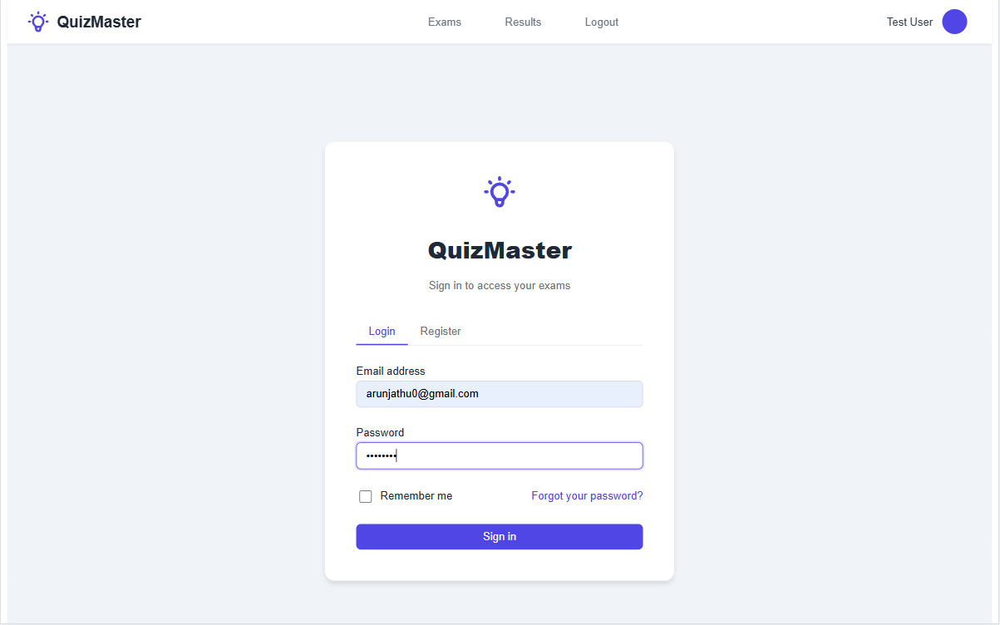
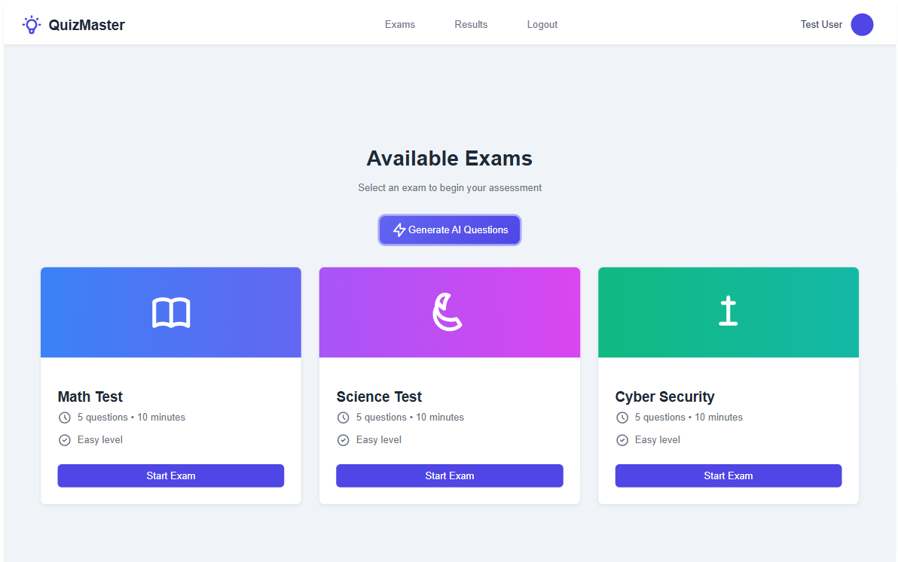
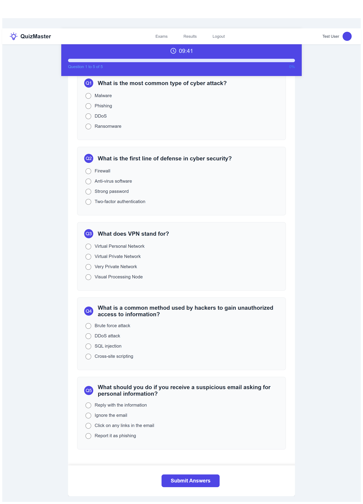
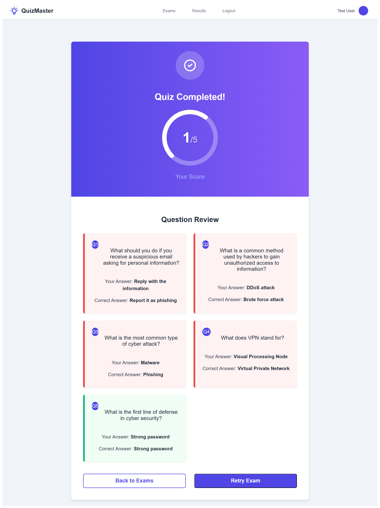
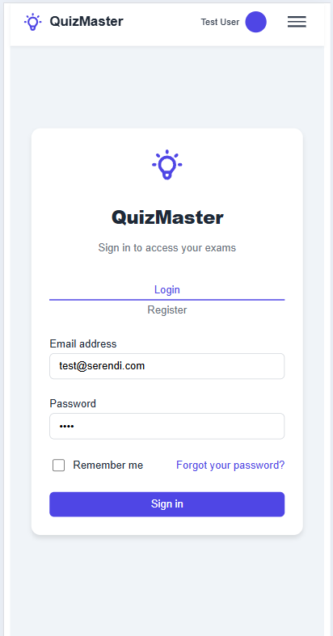
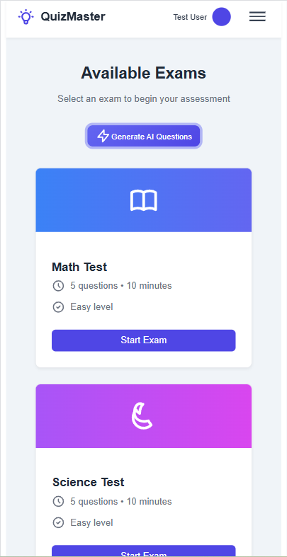

# Exam Application

Welcome to the Exam Application, a web-based platform for creating, attempting, and reviewing exams. This project features a React frontend and a Node.js backend, with AI-generated questions and real-time timer functionality. It’s designed to be responsive and user-friendly across devices.

## Table of Contents

- [Features](#features)
- [Prerequisites](#prerequisites)
- [Installation](#installation)
  - [Frontend](#frontend)
  - [Backend](#backend)
- [Usage](#usage)
- [Seeding Sample Data](#seeding-sample-data)
- [Development](#development)
- [Additional Tasks](#additional-tasks)
- [Contributing](#contributing)
- [License](#license)

## Features

- Create and attempt exams with multiple-choice questions, including AI-generated content.
- Real-time progress tracking and timer during exams.
- Detailed results page with question review.
- Responsive design for desktop and mobile devices.

## Screenshots

### Desktop Views

| Login Page                                      | Question List Page                                              |
| ----------------------------------------------- | --------------------------------------------------------------- |
|  |  |

| Attempt Page                                        | Results Page                                        |
| --------------------------------------------------- | --------------------------------------------------- |
|  |  |

### Mobile Views

| Login Page                                    | Question List Page                                            |
| --------------------------------------------- | ------------------------------------------------------------- |
|  |  |

| Attempt Page                                      | Results Page                                      |
| ------------------------------------------------- | ------------------------------------------------- |
|  |  |

## Prerequisites

- **Frontend**: Node.js (v14.x or later), npm (v6.x or later)
- **Backend**: Node.js (v14.x or later), npm (v6.x or later), MongoDB
- **API Keys**: OpenAI API key (for AI-generated questions, stored in `.env` as `OPENAI_API_KEY`)
- Ensure MongoDB is running locally or configure a remote URI.

## Project Overview

### Tech Stack Used

This project is built using the following technologies:

- **Frontend**:
  - React: A JavaScript library for building user interfaces.
  - Axios: For making HTTP requests to the backend API.
  - React Router DOM: For client-side routing.
  - React Confetti: For adding celebratory effects (e.g., on result page).
  - Tailwind CSS: For styling with utility-first classes.
- **Backend** :
  - Node.js/Express: For API endpoints (e.g., `/api/exams/result/${id}`).
  - MongoDB: For storing exam data (assumed based on `_id` usage).
- **Tools**:
  - Git: For version control.
  - npm: For package management.

### Sample Credentials

If your application includes authentication, you can use the following sample credentials to test the login functionality:

- **Username**: test@serendi.com
- **Password**: 1234

## Installation

### Frontend

1. Navigate to the `frontend` directory:

   ```bash
   cd frontend
   ```

2. Install dependencies:
   ```bash
   npm install
   ```

### Backend

1. Navigate to the `backend` directory:

   ```bash
   cd backend
   ```

2. Install dependencies:

   ```bash
   npm install
   ```

3. Create a `.env` file in the backend directory with the following:
   ```env
   MONGODB_URI=mongodb://localhost:27017/exam-app
   PORT=5000
   OPENAI_API_KEY=your-openai-api-key
   ```

## Usage

### Start the backend server:

```bash
cd backend
npm start
```

Or for development with auto-restart:

```bash
npm run dev
```

### Start the frontend development server:

```bash
cd frontend
npm run dev
```

Visit: [http://localhost:3000](http://localhost:3000)

Use the app to:

- Navigate exams
- Attempt questions
- View results
- Create new exams (with AI-generated questions)

## Seeding Sample Data

The project includes a `seed.js` script in the backend to populate MongoDB with sample exam data. This runs automatically after `npm install` via the `postinstall` script in `package.json`.

### Manual Seeding

If automatic seeding fails or you want to reseed manually:

1. Ensure MongoDB is running (e.g., run `mongod`).
2. Navigate to the backend directory:
   ```bash
   cd backend
   ```
3. Run the seed script:

   ```bash
   node seed.js
   ```

4. Verify data using:
   - MongoDB Compass
   - Mongo shell: `db.exams.find()`
   - Application UI

## Development

### Frontend

- Run in development:

  ```bash
  npm run dev
  ```

- Build for production:

  ```bash
  npm run build
  ```

- Run tests:
  ```bash
  npm test
  ```

### Backend

- Run in development:

  ```bash
  npm run dev
  ```

- No build step required for backend.

## Additional Tasks

The following features are implemented or planned for enhancement:

### AI Creation

- Backend endpoint: `/api/create-exam`
- Enhancements:
  - Add more question types (e.g., true/false, fill-in-the-blank)
  - Improve prompt engineering
  - Validate AI-generated content beyond 5-question limit

### Timer Implementation

- Real-time countdown timer during exams
- Enhancements:
  - Visual countdown (e.g., animation)
  - Low-time warning (color change, alert)
  - Timer persistence (using `localStorage` or backend sync)

## Contributing

1. Fork the repository.
2. Create a feature branch:
   ```bash
   git checkout -b feature-name
   ```
3. Commit your changes:
   ```bash
   git commit -m "Add feature-name"
   ```
4. Push to GitHub:
   ```bash
   git push origin feature-name
   ```
5. Open a pull request.

## License

This project is licensed under the MIT License. See the `LICENSE` file for details.
